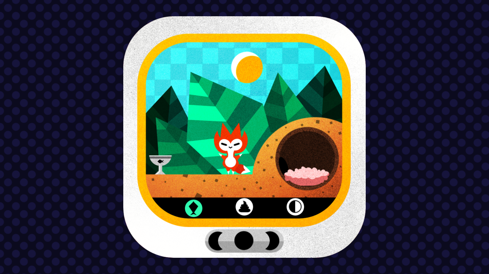
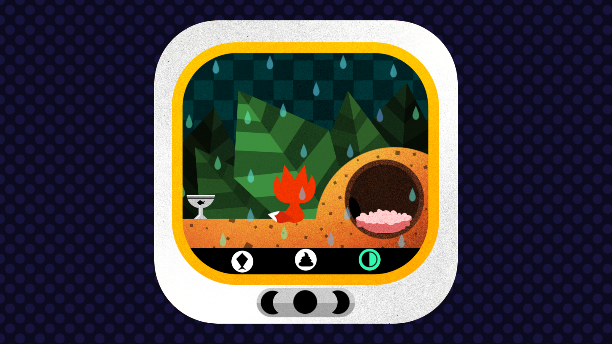
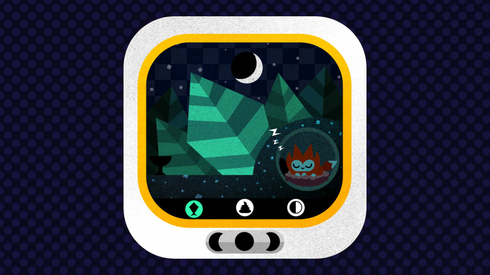
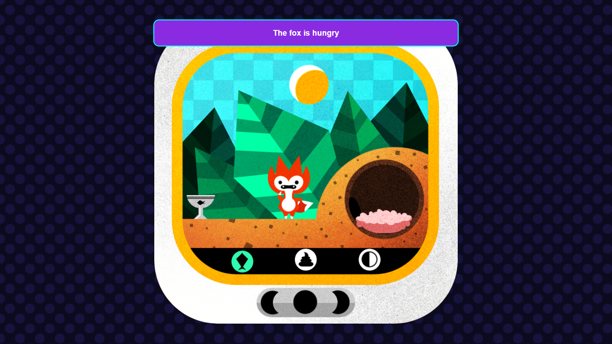
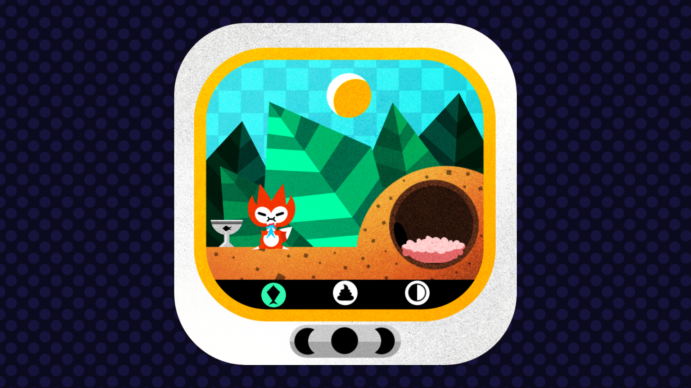
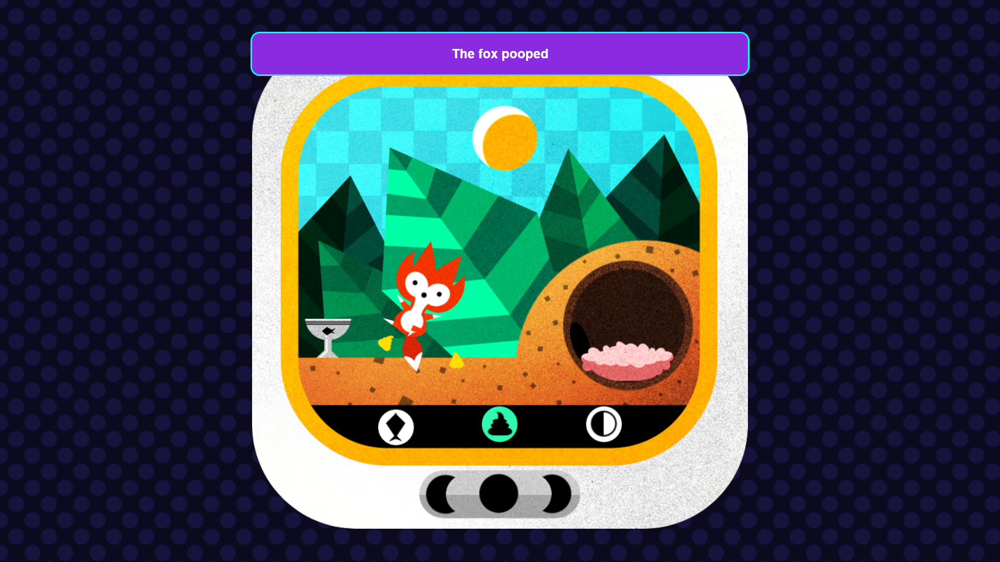
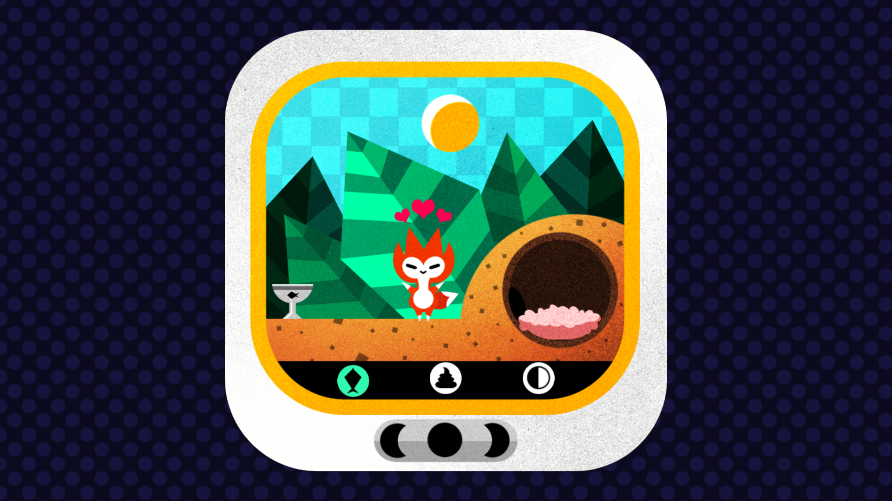
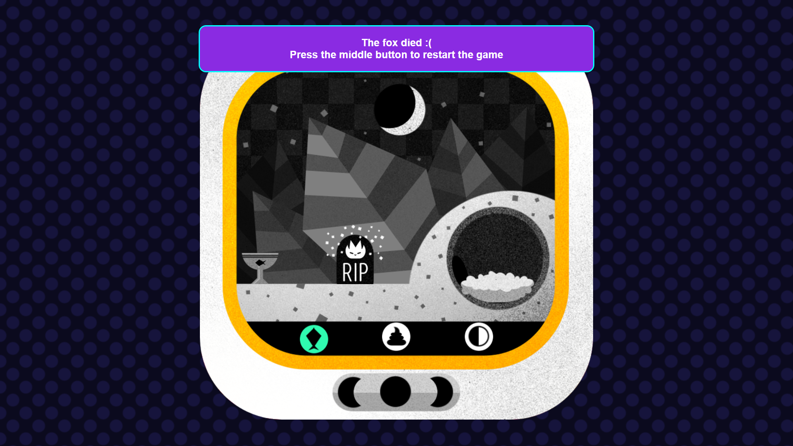

# Fox Game

A classic tamagotchi pet game in which the fox is able to feel hungry, poop, and the player must respond accordingly so that the fox can live as long as possible.

## How to play

The game consists of 3 actions, feeding the fox, cleaning the fox's poop, and changing the weather.

To start the game, user must press the middle button which will spawn the fox. Then, the fox will randomly get hungry, and the player has to feed the fox or else it will die:sob:. After eating, the fox will randomly poop, and the player has to clean it up or it can die:sob: because of poop. This pattern will keep on repeating until the fox dies.

If the fox dies, player can restart the game by pressing the middle button.

ENJOY THE GAME!!!

## Screenshots

- Game States
  
  
  

- The fox is hungry
  
  

- The fox is pooping
  
  

- The fox is dead :sob:
  

## How to run code locally on your computer

- Clone the repo or download the zip file.

```bash=
git clone https://github.com/LittleStar21/fox-game.git
```

- Go to the fox game directory

```bash=
cd fox-game
```

- Install the necessary node modules.

```bash=
npm install
```

- Build and run the project, then you can open the project in the given link. The server will usually run in http://localhost:1234

```bash=
npm run dev
```
